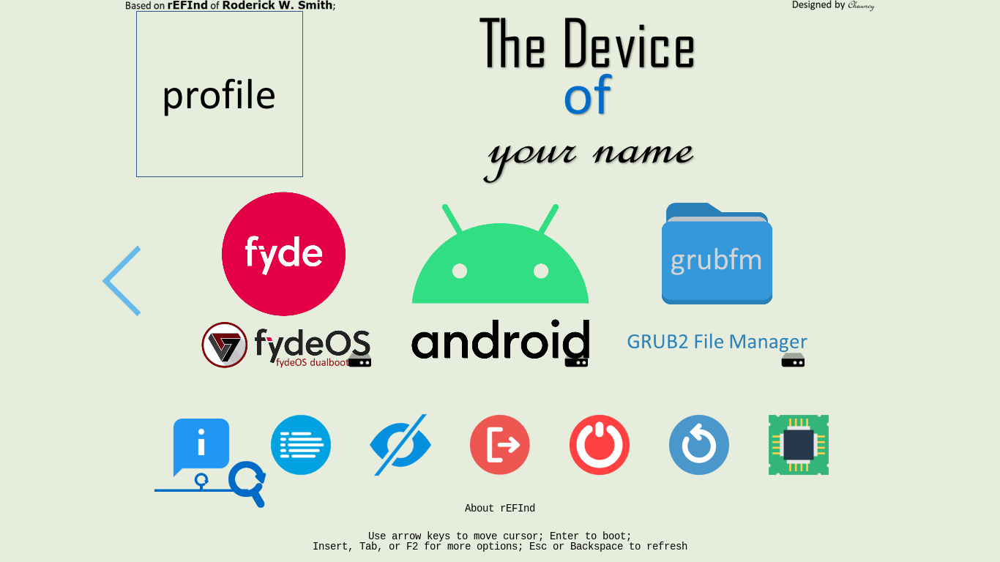
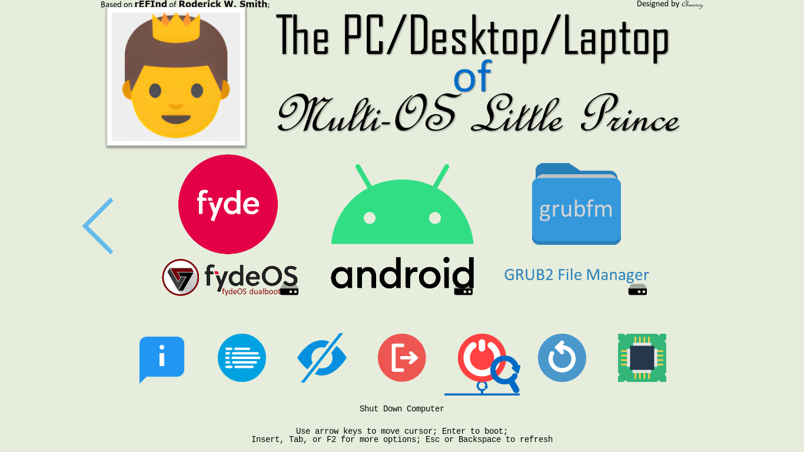
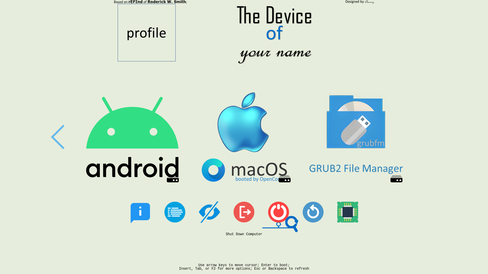
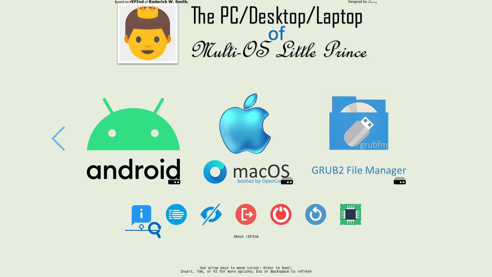

[English](README.md)|[简体中文](自述文件.md)|[繁體中文](繁體中文.md)
--|--|--

# Yours
Your own usual rEFInd's sign.

## 🧭Guide⬇️

🖱️Click to Unfold to see🖱️

### For UEFI Firmware
If your device meets the requirements,
- 64bit UEFI supported;
- GPU/vBIOS UEFI supported;
You should use .

### For Legacy BIOS
If your device meet the requirements,
- NOT supporting 64bit UEFI,
- - 32bit UEFI supported;
- - Only Legacy BIOS without UEFI supported;
- GPU/vBIOS UEFI not supported;
You should use .

## 💻️Preview👀

🖱️Click to Unfold to see🖱️

## ⭐Star🌟
If you like it and are looking forward to the coming update, you can star it.💫

## 🎉Credit🎊
- 
